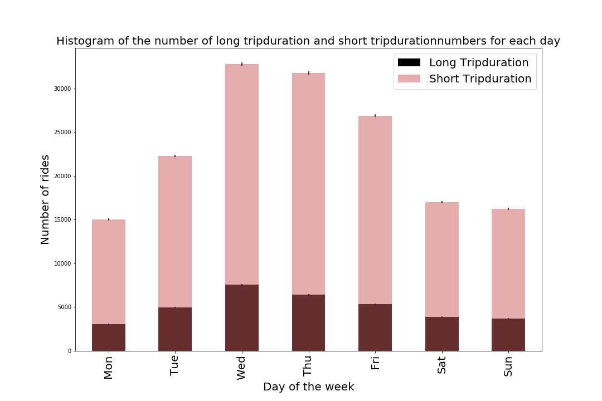

# HW11

## Assignment1

-https://github.com/louisalulu/PUI2018_ml4922/blob/master/HW11_ml4922/HW11_subway_timeseries_ml4922.ipynb

## Assignment2

-
### Figure 1 Histogram shows distribution of long tripduration (>=900) and short tripduration (<900) numbers for each day. From the plot, we can see that whatever weekdays or weekends, short trip numbers are significantly larger than long trip.

### I add the title and change color from blue to black which is easier to see overlapping. Also I change the size of x-label and y-label to make them clear. 
