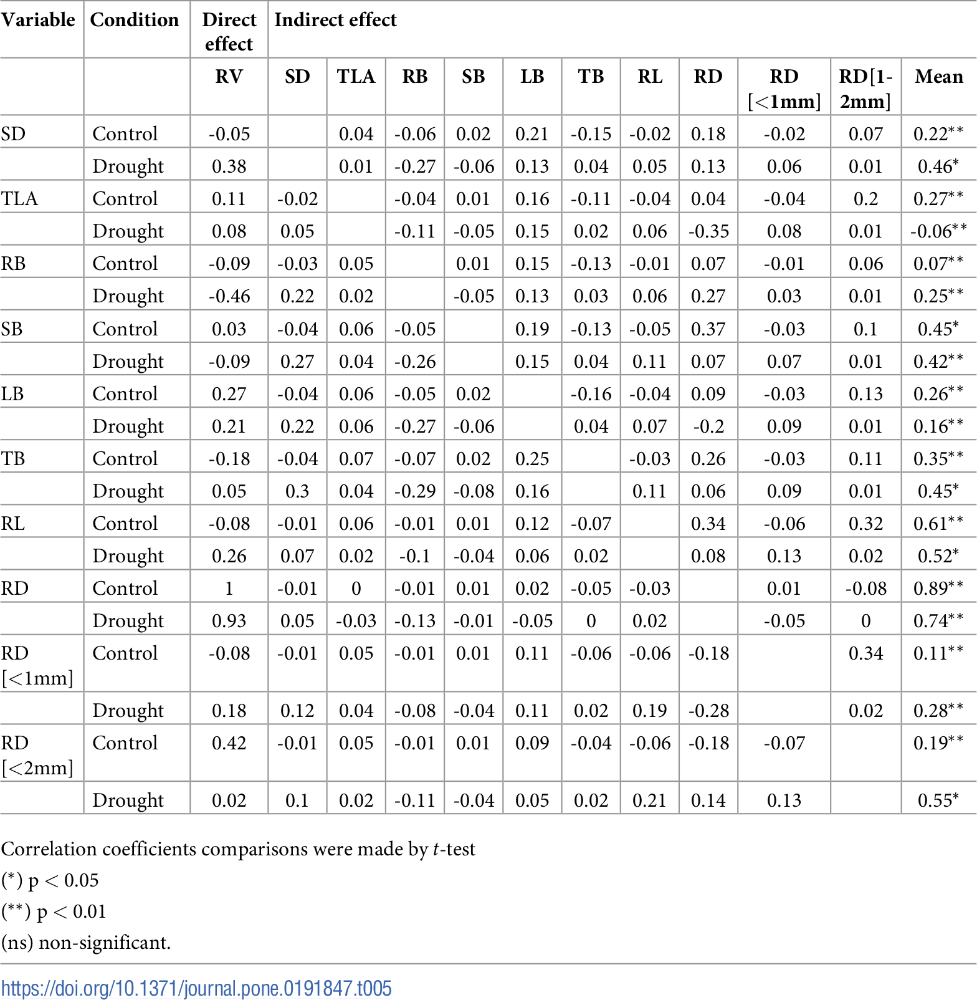

# HW6

## Assignment1
See CitibikeReview_ml4922.md

## Assignment2

### I worked with Jiawen Liang(jl9760). He did the ANOVA, I did the Path analysis, and we did the Logisitic Regression together.

| **Statistical Analyses**	|  **IV(s)**  |  **IV type(s)** |  **DV(s)**  |  **DV type(s)**  |  **Control Var** | **Control Var type**  | **Question to be answered** | **_H0_** | **alpha** | **link to paper**| 
|:----------:|:----------|:------------|:-------------|:-------------|:------------|:------------- |:------------------|:----:|:-------:|:-------|
ANOVA	| 8, Height; Weight; Relative Age; Sprint; Agility; Dribbling; Ball Control; Shooting | Categorical | 1, Adult Performance Level(APL)| categorical | 0 | N/A | 	Do the motor and anthropometric variables show a prognostic relevance for future success in adulthood? | Players who reached higher APL do not have better motor test result than players with lower APL. | 0.05 | [The influence of speed abilities and technical skills in early adolescence on adult success in soccer: A long-term prospective analysis using ANOVA and SEM approaches](https://journals.plos.org/plosone/article?id=10.1371/journal.pone.0182211) |
  |||||||||

| **Statistical Analyses**	|  **IV(s)**  |  **IV type(s)** |  **DV(s)**  |  **DV type(s)**  |  **Control Var** | **Control Var type**  | **Question to be answered** | **_H0_** | **alpha** | **link to paper**| 
|:----------:|:----------|:------------|:-------------|:-------------|:------------|:------------- |:------------------|:----:|:-------:|:-------|
Logisitic Regression	| 1, community size | Categorical | 1, not critical/critical scalar stress| nominal | 0 | N/A | 	Whether there is a significant relationship between the absence/presence of critical scalar stress and community size | There is no significant relationship between the absence/presence of critical scalar stress and community size | 0.05 | [Modeling Group Size and Scalar Stress by Logistic Regression from an Archaeological Perspective](https://journals.plos.org/plosone/article?id=10.1371/journal.pone.0091510) |
  |||||||||

| **Statistical Analyses**|  **IV(s)**  |  **IV type(s)** |  **DV(s)**  |  **DV type(s)**  |  **Control Var** | **Control Var type**  | **Question to be answered** | **_H0_** | **alpha** | **link to paper**| 
|:----------:|:----------|:------------|:-------------|:-------------|:------------|:------------- |:------------------|:----:|:-------:|:-------|
Path analysis	| 10, stem diameter, total leaf area per plant, root biomass, stem dry biomass, leaf dry biomass, total dry biomass, root length, root mean diameter for second order branches, fine roots length, medium roots length| continuous | 1, root volume | continuous | 1, different imposed water regimes  | continuous (could also be categorical) | 	What are the direct and indirect effects of those morphological characteristics on root volume. | Morphological alterations play an important role in tolerance of cacao progenies to water stress and that at least one morphological character has potential for direct or indirect selection of drought tolerance. | 0.05 | [Path analysis of phenotypic traits in young cacao plants under drought conditions](https://journals.plos.org/plosone/article?id=10.1371/journal.pone.0191847#abstract0) |
  |||||||||
  

## Assignment3
### Reproduce the analysis of the Hard to Employ program in NY:
-https://github.com/louisalulu/PUI2018_ml4922/blob/master/HW6_ml4922/Assignment3_ml4922_effectivenes%20of%20NYC%20Post-Prison%20Employment%20Programs.ipynb

## Assignment4
### Tests of correlation using the scipy package with citibike data：
-https://github.com/louisalulu/PUI2018_ml4922/blob/master/HW6_ml4922/Assignment4_ml4922_citibikes_compare_distributions.ipynb