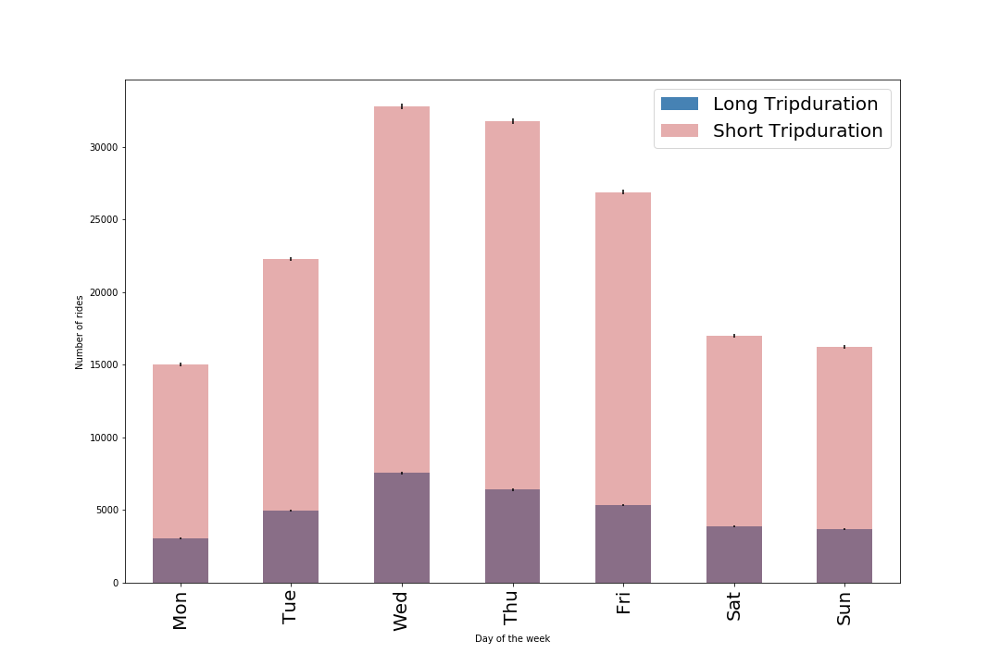

# HW8

## Assignment1

### Figure 1 Histogram shows distribution of long tripduration (>=900) and short tripduration (<900) numbers for each day. From the plot, we can see that whatever weekdays or weekends, short trip numbers are significantly larger than long trip.

## Assignment2
-code:
-report:
