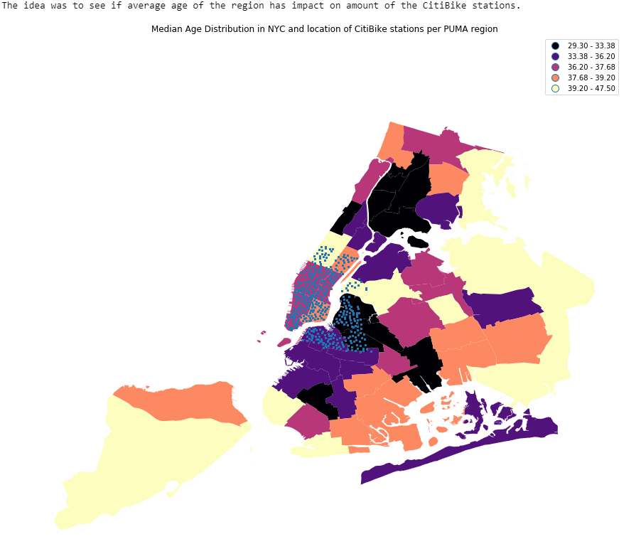

# Plot Review for em3845

This map shows median age distribution in NYC and location of Citibike Stations per PUMA region.

### CLARITY: 
Overall, this map is easy to read and understand. The map shows median age distribution in NYC and the blue dot is Citibike station location. But as Citibike Stations only locate in a small area on the map, it is hard to know how many stations in each region and judge each region has small or large number of stations.

### ESTHETIC:
Colour chosing for this map is good since each age group is easy to distinguish. As we want to know age distribution in each region, map is an appropriate choice.

### HONESTY:
I think the map honestly reproducing the data.

### Improvement:
For this map, I have two suggestions.

Firstly, colour chosing can be better, since when I first look at this map, it is a little bit mess.

Secondly, we can just plot age distribution of the regions in NYC which have Citibike Stations and also count the number of Citibike stations in each region showing on the map. 